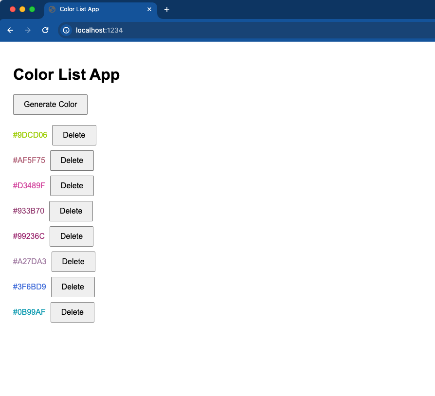

# Ditto Color List App - Quick Start


This is a basic Ditto quick start example in javascript. To goal is to get you syncing basic data with Ditto as fast as possible!


## Getting Started

1. Clone this repo - `git clone https://github.com/skylerjokiel/ditto-js-quickstart.git`
2. Navigate to the new folder - `cd ditto-js-quickstart`
3. Install dependencies - `npm install`
4. Open [./src/app.js](./src/app.js) and update the `appID` and `token` line 18 & 19 respectively with your Ditto App specific info found in the Ditto Portal. For more information on how to find these see: [https://docs.ditto.live/get-started/sync-credentials](https://docs.ditto.live/get-started/sync-credentials)
    ```js
    ditto = new Ditto({
    type: "onlinePlayground",
    appID: "YOUR_APP_ID",
    token: "YOUR_PLAYGROUND_TOKEN",
    });
    ```
5. Start the app from your terminal - `npm start`
6. Launch a browser window [http://localhost:1234](http://localhost:1234)

## Collaboration
To see real-time collaboration using Ditto
1. Open another tab and automatically see them syncing changes
2. Open the DQL Editor in the Ditto Portal to explore the data 
[https://portal.ditto.live/dql-editor/YOUR-APP-ID](https://portal.ditto.live/dql-editor/YOUR-APP-ID)

> ℹ️ Ditto's web application only support real-time collaboration through the Ditto cloud (Big Peer) and not direct peer-to-peer collaboration. This is due to limitation in system access that browsers provide.

## App Overview
The `Generate Color` button will add a new `color` document to our `colors` collection and display in a list along side. Deleting a color will mark the `isDeleted` flag to true and it will be filtered from the view.


## Data Modeling

Documents are stored in the `colors` collection.

Document in the `colors` collection have the following schema:
```js
{
    _id: string // uuid auto generated by Ditto
    color: string // hex value
    isDeleted: boolean // denotes if the color was deleted (default false)
}
```

## Troubleshooting

If your app is working but not syncing data these are common errors you might find in the console.

### Invalid App ID
> Uncaught (in promise) Error: Provided App ID was not a valid UUID
    at dittoIdentityConfigMakeOnlinePlayground (ditto.es6.js:1:78162)
    at ditto.es6.js:1:194788
    at new Ditto (ditto.es6.js:1:195096)
    at HTMLDocument.<anonymous> (app.js:14:11)

If you see the above message it means that your provided Ditto AppID was invalid. Make sure to follow step 4 in the Getting Started section.

### Invalid Token
> POST https://YOUR-APP-ID.cloud.ditto.live/_ditto/auth/login 401 (Unauthorized)

If you see the above message it means that your App ID is valid but the token your provided is invalid. Double check to make sure you have the correct App ID and Playground Token from the Ditto Portal.